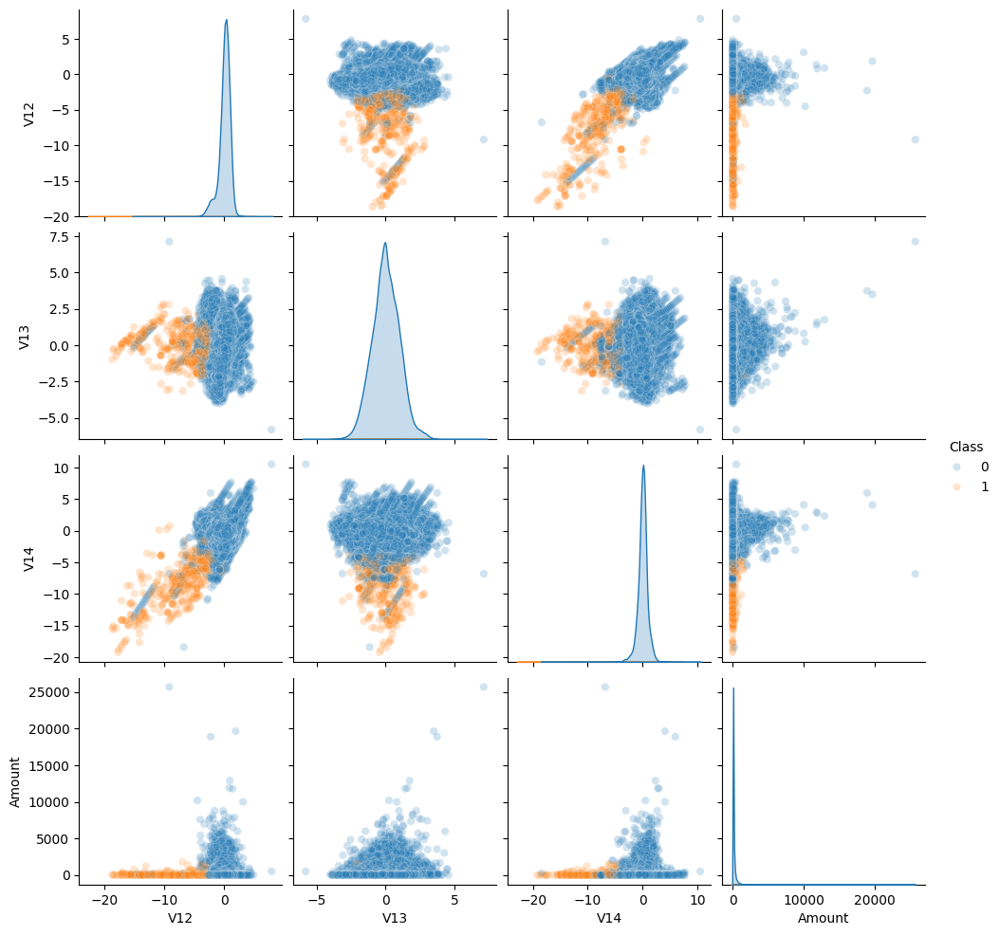

# 💳 Detección de Fraude de transacciones bancarias

👥 **Integrantes:**
- Ariel Vargas  
- Domenica Bolaños  

## 🏦 Introducción

Los fraudes en transacciones bancarias constituyen un delito financiero significativo y creciente, especialmente en la era de la banca digital. Se definen como un conjunto de estafas y actividades ilícitas cuyo objetivo principal es obtener fondos, información confidencial, o acceso no autorizado a las cuentas de clientes e instituciones financieras. Estos actos provocan grandes pérdidas económicas tanto a individuos como a empresas a nivel global.

## 📊 Dataset

Se utilizó un dataset de Kaggle Credit Card Fraud Detection, donde se tiene las siguientes variables:
- **Time**: Números de segundos entre realización de la transacción  
- **V1 - V28**: Características de las transacciones con transformadas en PCA  
- **Amount**: Cantidad realizada en la transacción  
- **Class**: Determina si la transacción es fraude o Legítima (0: Legítima, 1: Fraude)

## 🎯 Objetivo

Realizar un modelo de Machine Learning para detectar si las próximas transacciones serían fraudes o legítimas.

## ⚙️ Descripción del Problema

### 🧹 Preprocesamiento

Se realizó un análisis del dataset para verificar su información, tipo de datos, etc. Además, se evidenció una **severa desproporción** en la visualización del desbalance de clase entre transacciones fraudulentas y legítimas (aproximadamente **0.17%** de fraude).

Para manejar este problema de desbalance y evitar que el modelo ignore la clase minoritaria:
1. Se utilizó el ajuste de **peso de clase** intrínseco de XGBoost mediante el parámetro **`scale_pos_weight`**. Este parámetro se establece con la razón del número de ejemplos negativos sobre el número de ejemplos positivos, dirigiendo el enfoque del modelo a la detección de fraude.

### 🧠 Entrenamiento y Optimización

Para lograr un modelo robusto, se utilizó el algoritmo **XGBoost Classifier**. Se realizó un **ajuste de hiperparámetros (HPO)** utilizando la librería **Optuna** para encontrar la configuración óptima, basándose en la métrica **AUC-ROC** debido a que nos permite clasificar el modelo si es fraude o legítima. El modelo fue entrenado con la estrategia de peso de clase, de esa manera manejamos el desbalance de clase utilizando la razón entre los números de ejemplos entre las transacciones legítimas y el número de peso entre las transacciones fraudulentas.

Luego del entrenamiento, se implementó la librería **SHAP (SHapley Additive exPlanations)** para generar gráficos de explicabilidad y justificar las decisiones del modelo.

Se revisó la **curva de calibración** inicial. Dado que no estaba cerca de la línea de perfecta calibración, se realizó un proceso de **calibración del modelo** utilizando estrategias basadas en cuantiles para mejorar la correspondencia entre las probabilidades predichas y las observadas. **Las métricas de desempeño y la evaluación final se basan en este modelo calibrado.**

## 📈 Análisis y Resultados

1.  El análisis de Detección se centra en la capacidad de detección. La **Matriz de Confusión** demuestra que el modelo optimizado logra un alto valor de **Recall (Exhaustividad)**. El modelo optimizado originalmente por Optuna (XGBoost) mostró un Recall de 0.83 con una Precisión de 0.70. Sin embargo, tras el proceso de calibración para mejorar la fiabilidad de las probabilidades, los valores finales son:
    * **Recall del Modelo Calibrado:** **0.74**
    * **Precisión del Modelo Calibrado:** **0.83**
    

      
2.  La optimización con Optuna y el proceso de calibración resultaron en un **ROC-AUC de 0.9715**. Este valor, muy cercano a 1.0, indica que el modelo tiene una excepcional capacidad para discriminar entre las clases.

3.  Este análisis confirma el equilibrio entre detección y fiabilidad. El valor del **Área Bajo la Curva de Precisión-Recall (PR-AUC)** es de **0.8540**. Este valor valida que el modelo mantiene una **buena Precisión** (0.83) incluso cuando se maximiza la detección de fraude (alto Recall de 0.74).

4.  La implementación de **SHAP** provee transparencia al modelo. El **Summary Plot** y el **Bar Plot** confirman que las características **V14**, **V4**, y **V3** son las más influyentes. El **Dependence Plot** demuestra, por ejemplo, que valores **muy negativos** en la característica **V14** tienen el **mayor impacto positivo** en la predicción de fraude, justificando las clasificaciones del modelo.

## 🧾 Conclusión

El objetivo de crear un modelo de Machine Learning para detectar transacciones fraudulentas se cumplió con éxito utilizando un enfoque avanzado de **XGBoost optimizado por Optuna** y calibrado.

El modelo logró un equilibrio sólido entre detectar la mayor cantidad de fraudes posibles (alto **Recall** de **0.74**) y evitar la generación excesiva de alertas falsas (alta **Precisión** de **0.83**). La evidencia de la **Matriz de Confusión** y la métrica **PR-AUC** (0.8540) confirma que la solución es robusta contra el severo desbalance de clases, proporcionando una herramienta valiosa para la mitigación de riesgos en transacciones bancarias.

Es fundamental destacar que la Exactitud (Accuracy) no es una métrica válida para evaluar este proyecto, ya que el dataset está severamente desbalanceado. Un alto valor de Accuracy sería engañoso y no reflejaría la verdadera capacidad del modelo para detectar fraudes. Por esta razón, la evaluación se centró en las métricas de rendimiento para la clase minoritaria.

---

## 📂 Estructura del Proyecto y Entorno

La estructura de carpetas se organiza para seguir el flujo de trabajo del científico de datos, desde el modelado hasta la generación de outputs explicativos:

/ (Raíz del Proyecto)  
      │  
      ├── README.md                 # Documentación general del proyecto  
      ├── Proyecto_CIAP.ipynb       # Notebook principal con análisis y modelado  
      │  
      ├── /Entrenamiento/           # Archivos y scripts del proceso de Machine Learning  
      │  
      ├── /Implementación/          # Código para pruebas con nuevos datos (uso del modelo)  
      │  
      └── /Visualización/           # Resultados gráficos (curvas ROC/PR, SHAP, etc.)
   

### 💻 Versión de Python y Librerías Clave
El proyecto fue desarrollado y ejecutado en un entorno de Google Colab.

**Python Versión:** Python 3.10+ (Estándar en Google Colab)

**Librerías Clave (Utilizadas para las métricas y optimización):**
- **xgboost** y **optuna**: Para el modelado y la optimización de hiperparámetros.  
- **shap**: Para la explicabilidad de las decisiones del modelo.  
- **sklearn**: Para el preprocesamiento y el cálculo de métricas esenciales.  
- **matplotlib**, **seaborn**: Para la visualización de resultados.

